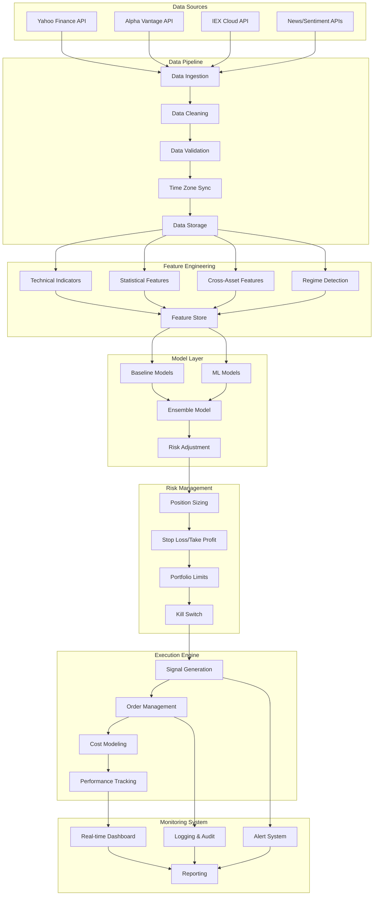
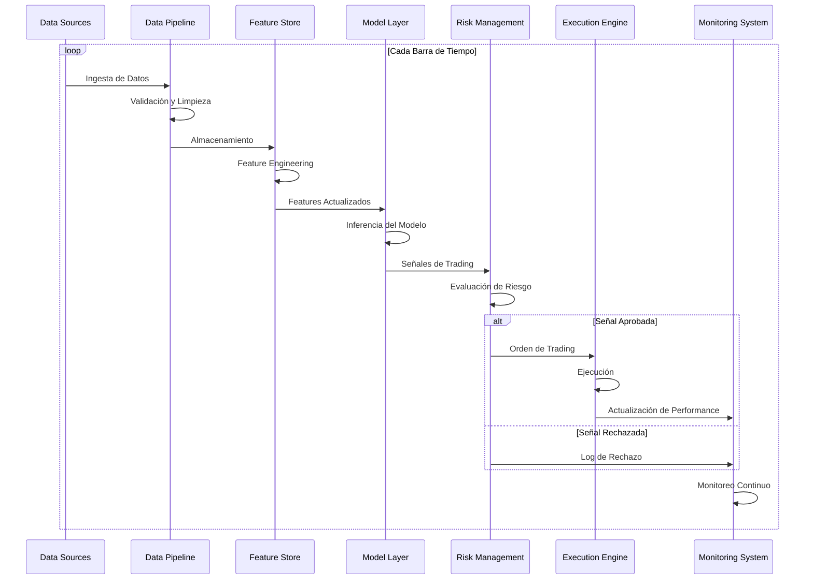
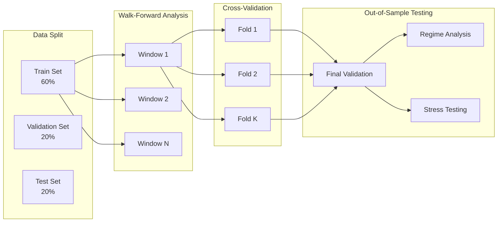
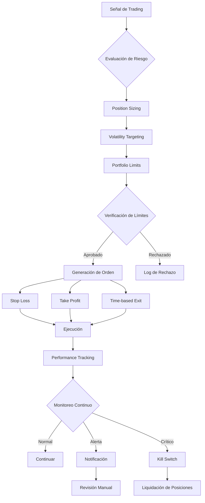
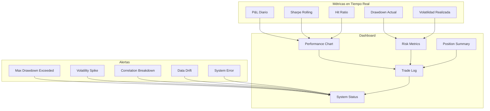
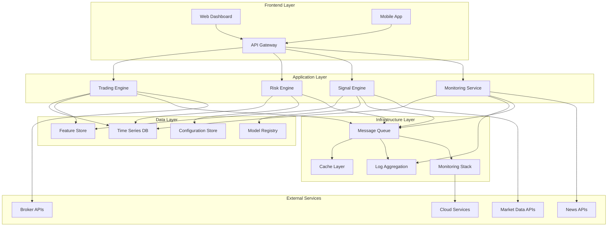

# Diagrama de Arquitectura del Sistema de Trading

## Diagrama de Flujo Principal

## Diagrama de Flujo de Datos Temporal

## Diagrama de Validación y Backtesting

## Diagrama de Gestión de Riesgo

## Diagrama de Monitoreo en Tiempo Real

## Diagrama de Arquitectura Técnica

